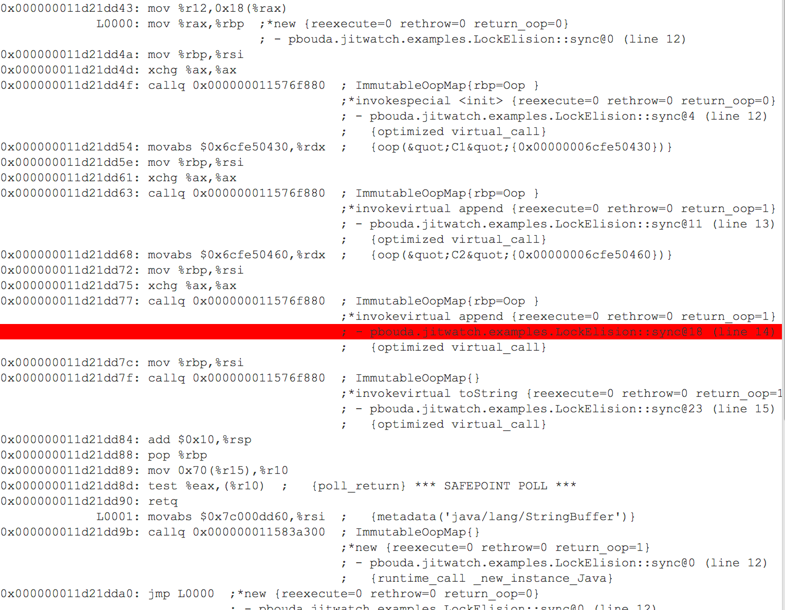
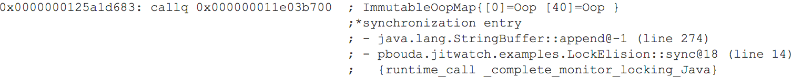

# Lock Elision

- Useful technique to eliminate multiple lock that are confined 
- It does not make sense to multiple times enter the same monitor
- We have to use option `-XX:-EliminateLocks` to see difference in JITWatch

- On the picture below, we disabled a lock elimination and we can see how JIT Compiler generated `monitorenter` 
and `monitorexit` for one print invocation.

- Now we can see that JIT Compiler generated only one `monitorenter` and then all three invocation one after the other.

